## Table of Contents

- [1. QCBM 项目介绍](#user-content-1-qcbm-项目介绍)
- [2. 项目资源说明](#user-content-2-项目资源说明)
- [3. TKE 上部署 QCBM](#user-content-3-tke-上部署-qcbm)
  * [3.1 安装 kubectl](#user-content-31-安装-kubectl)
  * [3.2 创建 k8s 集群 qcbm](#user-content-32-创建-k8s-集群-qcbm)
  * [3.3 创建基础配置](#user-content-33-创建基础配置)
  * [3.4 部署 qcbm 服务](#user-content-34-部署-qcbm-服务)
- [4. 创建 CLS 日志服务](#user-content-4-创建-cls-日志服务)
  * [4.1 开启容器日志采集功能](#user-content-41-开启容器日志采集功能)
  * [4.2 创建日志集](#user-content-42-创建日志集)
  * [4.3 创建日志主题](#user-content-43-创建日志主题)
  * [4.4 创建容器日志采集规则](#user-content-44-创建容器日志采集规则)
  * [4.5 创建日志索引并查看日志](#user-content-45-创建日志索引并查看日志)

## 1. QCBM 项目介绍

Q云书城（QCBM）是一个基于腾讯云原生产品之上，使用 dubbo-2.7.8 框架开发的一个网上书城 Demo 项目。

Q云书城 项目由以下部分组成：

- **QCBM-Front** ：使用 react 开发的前端项目，基于 nginx 官方提供的 [1.19.8 docker 镜像](https://hub.docker.com/_/nginx) 构建和部署。
- **QCBM-Gateway** ：API 网关，接受前端的 http 请求，并转化为后台的 dubbo 请求。
- **User-Service** ：基于 dubbo 的微服务，提供用户注册、登录、鉴权等功能。
- **Favorites-Service** ：基于 dubbo 的微服务，提供用户图书收藏功能。
- **Order-Service** ：基于 dubbo 的微服务，提供用户订单生成和查询等功能。
- **Store-Service** ：基于 dubbo 的微服务，提供图书信息的存储等功能。

Q云书城 的所有项目均做了容器化，最终运行于腾讯云的 [容器服务 TKE ](https://cloud.tencent.com/product/tke) 上。本项目所采用的腾讯云产品及部署架构如下：

- **网路架构**：整个项目采用一个 VPC，并划分为两个子网：Subnet-K8S 中部署 QCBM 的应用服务，所有服务都进行了容器化，运行在 TKE 上；Subnet-Basic 中部署了有状态的基础服务，包括 Dubbo 的服务注册中心 Nacos，MySQL 和 Redis 等。
- **CDB**：选用的是 MySQL 5.7，双节点，主从直接异步复制数据。
- **Redis**：选用的 5.0 标准版，一主一备模式。
- **CVM**：选用的 SA2 标准版，运行CentOS 8.0，开启 置放群组功能。
- **TKE**：选择的是 1.18.4 版的 kubernetes，并使用 Global Router；Kube-proxy 选择的是 iptables，运行时版本为 18.6。K8S Master 采用平台托管，Worker 启用置放群组功能。

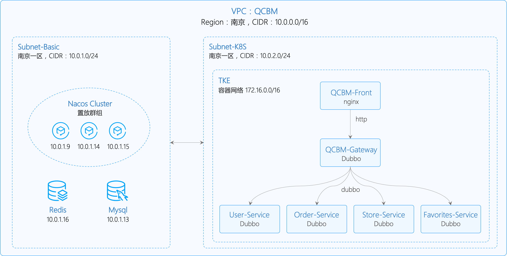

以上是本文中 QCBM 项目使用的环境资源，运行 QCBM 项目时，可选择不同的配置方式。运行 QCBM 项目前，请先熟悉和了解 Kubernetes 原理和 k8s 集群管理的命令行工具 [kubectl](https://kubernetes.io/zh/docs/reference/kubectl/overview/) 的基本使用。

## 2. 项目资源说明

本项目下有两个目录分别存放不同的部署 yaml

- **qcbm-ddl.sql**：MySQL 初始化脚本
- **config.yaml**: 配置 yaml
- **qcbm-dubbo.yaml**: 工作负载和服务的部署 yaml
- **log-rule.yaml**：容器日志采集规则 yaml

~~~sh
➜  qcbm-k8s git:(master) ✗ tree 
.
├── README.md
├── config.yaml
├── log-rule.yaml
├── pic
│   ...
├── qcbm-ddl.sql
└── qcbm-dubbo.yaml
~~~

## 3. TKE 上部署 QCBM

### 3.1 安装 kubectl

Kubectl 是 Kubernetes 的命令行工具，可以在本地运行 Kubernetes 命令。具体安装请见文档：[安装并配置 kubectl](https://kubernetes.io/zh/docs/tasks/tools/install-kubectl/) 。

### 3.2 创建 k8s 集群 qcbm

实际部署前，需要新建个 K8S 集群。有关集群的创建，官方文档 [购买容器集群](https://cloud.tencent.com/document/product/457/9082) 中有详细说明。但有一点需要注意：在创建集群第二步 “选择机型” 时，建议开启 “置放群组功能” 可将 CVM 打散到到不同母机上，增加系统可靠性。

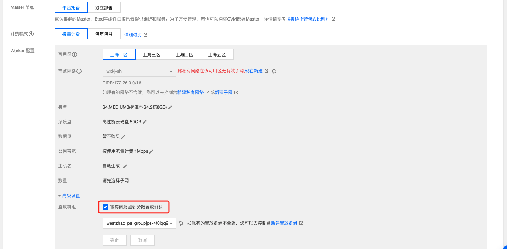

创建完成后，在容器服务控制台的 [集群管理](https://console.cloud.tencent.com/tke2/cluster) 页面可以看到新建的集群信息。这里我们新建的集群名称为 qcbm-k8s-demo。

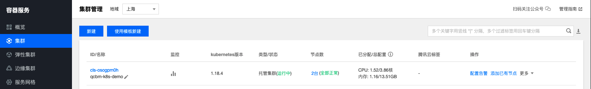

选择集群 qcbm-k8s-demo 点击进入 **基本信息** 页面，可以看到整个集群的配置信息。

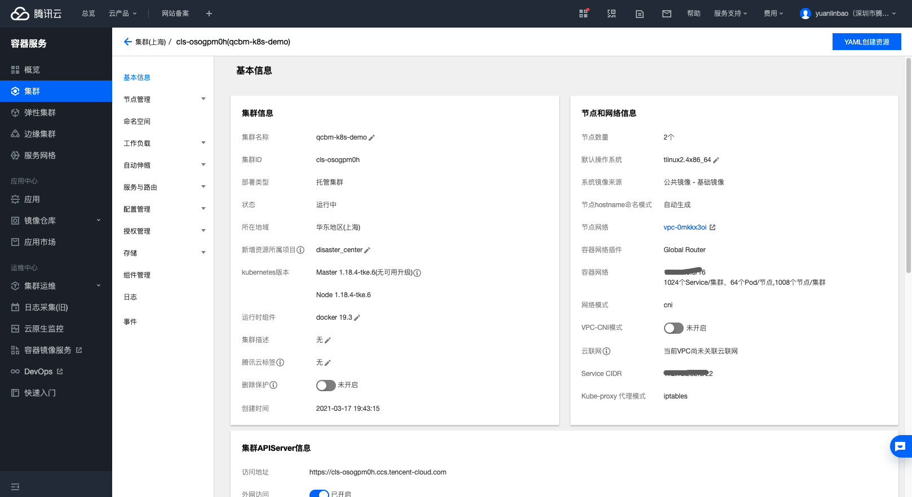

如果需要使用 kubectl 和 lens 等 K8S 管理工具，还需要以下两步操作：

- 开启外网访问
- 将 api 认证 Token 保存为本地 `用户 home/.kube` 下的 config 文件中（若 config 文件已有内容，需要替换），这样每次访问都能进入默认集群中。当然也可以不保存为 `.kube` 下的 config 文件中，相关操作指引见  **集群APIServer信息** 下的 **通过Kubectl连接Kubernetes集群操作说明**。

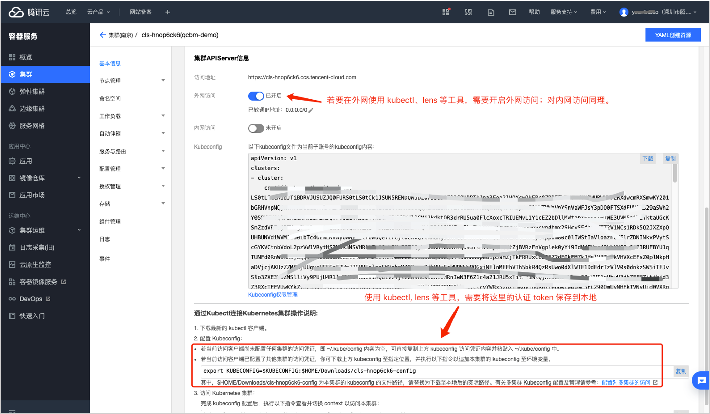

### 3.3 创建基础配置

实际项目上 K8S 前都有很多基本配置，对于 QCBM 项目也一样，需要提前完成以下基础配置，才能成功部署：

- 在 [Mysql 控制台](https://console.cloud.tencent.com/cdb) 创建好实例, 并使用 `qcbm-ddl.sql` 初始化；

- 在 [Redis 控制](https://console.cloud.tencent.com/redis) 创建好实例并初始化；

- 部署 Nacos 集群，需要现在 [CVM 控制台](https://console.cloud.tencent.com/cvm) 购买3台 “标准型SA2“ 1C2G 的 CVM，接着安装 java。

  ~~~sh
  # 安装 java
  yum install java-1.8.0-openjdk-devel.x86_64
  # 执行下面命令，如有输出 java 版本信息，说明 java 安装成功
  java -version
  ~~~
   
  最后，部署 Nacos 集群，可参考 Nacos 官方文档 [集群部署说明](https://nacos.io/zh-cn/docs/cluster-mode-quick-start.html) 。若想简单部署，可只购买1台CVM，使用下面的部署命令：

  ~~~sh
  # Nacos 单节点部署方式，不适用集群部署！
  # 下载 Nacos
  wget https://github.com/alibaba/nacos/releases/download/2.0.0/nacos-server-2.0.0.tar.gz
  # 解压
  tar -zxvf nacos-server-2.0.0.tar.gz
  # 进入 bin 目录，然后用下面命令启动 Nacos
  ./startup.sh -m standalone
  ~~~

- 在 [CLB 控制台](https://console.cloud.tencent.com/clb) 为子网 Subnet-K8S 新建个内网型的 CLB，并用该 CLB 实例 ID 替换 `qcbm-dubbo.yaml` 中的 ***lb-xxx***

  ~~~yaml
  # 将此处的 lb-xxx 修改为子网 subnet-k8s 购买的 CLB 实例 ID
  annotations:
    service.kubernetes.io/loadbalance-id: lb-xxx
  ~~~

- 在 TSW 控制台的 [【服务观测】](https://console.cloud.tencent.com/tsw/service)->【服务列表】页，单击【接入服务】，选择 Java 语言与 SkyWalking 的数据采集方式。然后，在接入方式下获取接入信息：***接入点*** 和 ***Token*** 信息。

  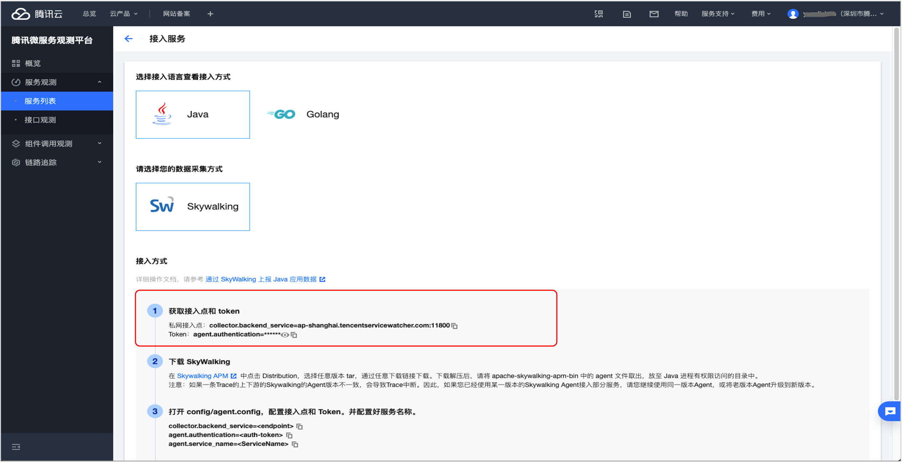

- 修改 `config.yaml` 中下面变量的值：
  - Nacos 地址：NACOS_HOST
  - Mysql 地址：MYSQL_HOST
  - Redis 地址：REDIS_HOST
  - Mysql 账号：MYSQL_ACCOUNT （需要先转换为 Base64 编码格式）
  - Mysql 密码：MYSQL_PASSWORD （需要先转换为 Base64 编码格式）
  - Redis 密码：REDIS_PASSWORD （需要先转换为 Base64 编码格式）
  - 用 TSW 接入点 更新 SW_AGENT_COLLECTOR_BACKEND_SERVICES 变量
  - 用 TSW Token 更新 SW_AGENT_AUTHENTICATION （需要先转换为 Base64 编码格式）
 

### 3.4 部署 qcbm 服务

部署步骤如下：

- 创建 config

    ~~~sh
    kubectl apply -f config.yaml
    ~~~

- 创建后端服务

  ~~~sh
  kubectl apply -f qcbm-dubbo.yaml
  ~~~

至此，已完成 QCBM 在 TKE 上的部署。通过 [容器服务控制台](https://console.cloud.tencent.com/tke2)，在【集群】->【服务与路由】->【Ingress】下可以看到创建的 Ingress，通过 ingress 的 VIP 就可以访问 Q云书城 的页面了。

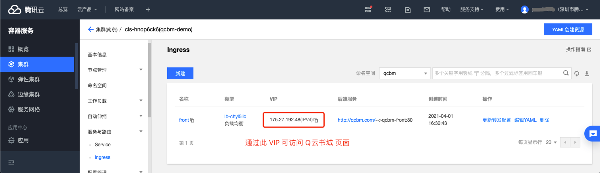

此时，TSW 也集成好，在 QCBM 页面上点击操作后，在 [TSW 控制台](https://console.cloud.tencent.com/tsw) 下的【链路追踪】-> 【调用链查询】页面可查看调用链的具体信息。

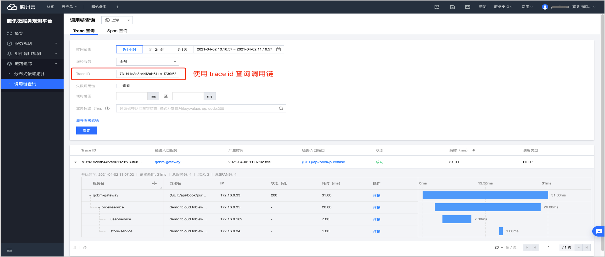

## 4. 创建 CLS 日志服务

现在 CLS 上查看 QCBM 的日志，还需要进一步操作。

### 4.1 开启容器日志采集功能

- 登录 [容器服务控制台](https://console.cloud.tencent.com/tke2)，选择左侧导航栏中的【集群运维】->【功能管理】。在“功能管理”页面上方选择地域，单击需要开启日志采集的集群右侧的【设置】

  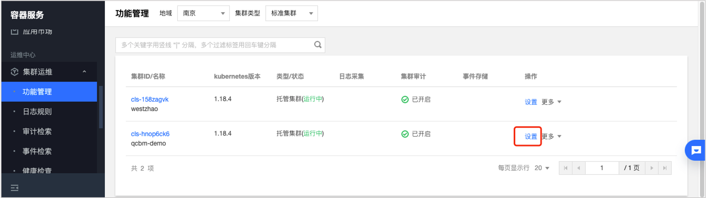

- 在“设置功能”页面，单击日志采集【编辑】，开启日志采集后确认。如下图所示：

  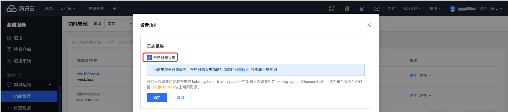

### 4.2 创建日志集

在日志服务控制台（ https://console.cloud.tencent.com/cls/logset）选择日志服务区域（和服务部署区域一致）。然后点击“创建日志集” 创建日志集 qcbm-logs。

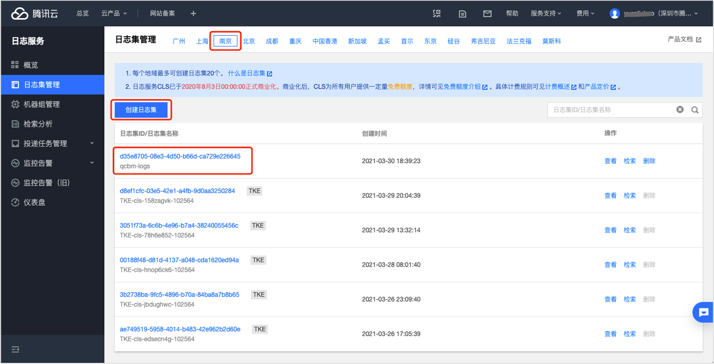

### 4.3 创建日志主题

单击“日志集名称”，进入到日志主题管理页面。单击 “新增日志主题”，开始创建日志主题。QCBM 有多个后端微服务，为每个微服务建个日志主题便于日志归类。

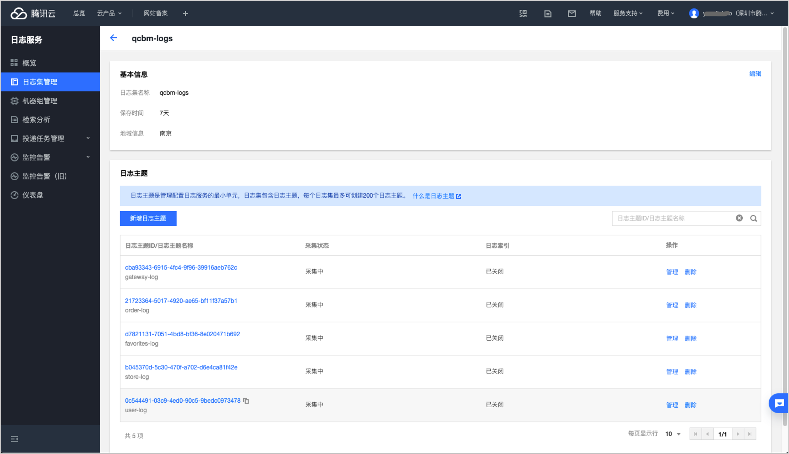

### 4.4 创建容器日志采集规则

用 4.3 中创建的日志主题 ID，填写到 `log-rule.yaml` 中 ***topicId*** 下，然后使用如下命令创建日志采集规则：

~~~sh
# 创建日志采集规则
kubectl apply -f log-rule.yaml
~~~

### 4.5 创建日志索引并查看日志

在容器日志服务控制台的【检索分析】中可先为日志【新建索引】：

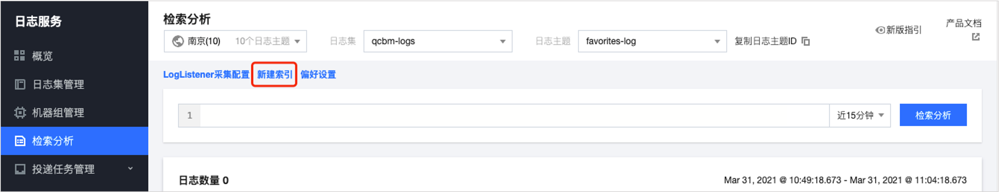

然后点击 【检索分析】按钮即可查看日志。

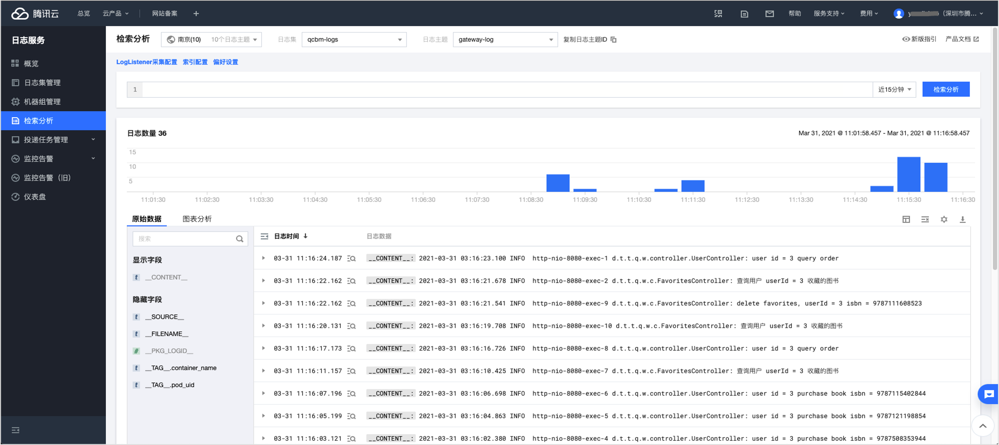
