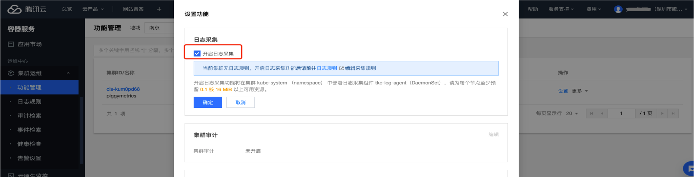

## 1. PiggyMetrics 项目介绍

PiggyMetrics 是一个 github 上的开源项目 [PiggyMetrics](https://github.com/sqshq/piggymetrics),使用 SpringCloud 框架开发的个人记账理财的应用。PiggyMetrics 服务组成如下：

-  **API网关** ：基于Spring Cloud Zuul的网关，是调用后台API的聚合入口，实现反向路由和负载均衡(Eureka+Ribbon)、限流熔断(Hystrix)等功能。CLIENT单页应用和ZUUL网关暂住在一起，简化部署。
-  **服务注册和发现** ：基于Spring Cloud Eureka 的服务注册中心。业务服务启动时通过Eureka注册，服务之间调用也通过Eureka做服务发现。
-  **授权认证服务** ：基于Spring Security OAuth2 的授权认证中心。客户端登录时通过 AUTHSERVICE 获取访问令牌。服务之间调用也通过AUTHSERVICE获取访问令牌(走客户端模式)。令牌校验方式~各资源服务器去AUTHSERVICE集中校验令牌。
-  **配置服务** ：基于 Spring Cloud Config 的配置中心，集中管理所有Spring服务的配置文件。
-  **软负载和限流熔断** ：基于Spring Cloud Ribbon&Hystrix，Zuul 调用后台服务，服务之间相互调用都通过Ribbon实现软负载，也通过Hystrix实现熔断限流保护。
-  **METRICS & DASHBOARD** ：基于 Spring Cloud Turbine + Hystrix Dashboard，对所有 Hystrix 产生的 Metrics 流进行聚合，并展示在Hystrix Dashboard上。

> 为了结合TKE和腾讯云上其它产品在容器化下的使用，本文对原始的 PiggyMetrics 项目做了些改动:
> - 将原先容器化 mongodb 改用腾讯云上 mongodb 产品;
> - 修改了日志配置，已更好的展示腾讯云日志产品 CLS 的使用；
> - 引入了 skywalking agent，以便在腾讯云微服务观测平台 TSW 上查看调用链和其它信息；

PiggyMetrics 项目所采用的腾讯云产品及部署架构如下：

- 网路架构：整个项目采用一个 VPC，并划分为两个子网：Subnet-K8S 中部署 QCBM 的应用服务，所有服务都进行了容器化，运行在 TKE 上；Subnet-Basic 中部署了有状态的基础服务，包括 Dubbo 的服务注册中心 Nacos，MySQL 和 Redis 等。
- MongoDB：选用的是 TencentDB for MongoDB WiredTiger 引擎版。
Redis：选用的 5.0 标准版，一主一备模式。
- TKE：选择的是 1.18.4 版的 kubernetes，并使用 Global Router；Kube-proxy 选择的是 iptables，运行时版本为 18.6。K8S Master 采用平台托管，Worker 启用置放群组功能。

以上是本文中 PiggyMetrics 项目使用的环境资源，运行该项目时，可选择不同的配置方式。运行 PiggyMetrics 项目前，请先熟悉和了解 Kubernetes 原理和 k8s 集群管理的命令行工具 kubectl 的基本使用。

## 2. 项目资源说明

PiggyMetrics 项目中的资源文件如下：

- account-service-dump.js：mongodb 初始化文件
- config.yaml: 配置 yaml
- basic.yaml: 后台微服务依赖的基础服务（配置中心，注册中心等）部署 yaml
- backend.yaml: 后台微服务的工作负载和service的部署 yaml
- log-rule.yaml：容器日志采集规则 yaml

~~~
.
├── README.md
├── account-service-dump.js
├── backend.yaml
├── basic.yaml
├── config.yaml
├── log-rule.yaml
└── pic
    └── ...
~~~

## 3. TKE 上部署 QCBM

### 3.1 安装 kubectl
Kubectl 是 Kubernetes 的命令行工具，可以在本地运行 Kubernetes 命令。具体安装请见文档：[安装并配置 kubectl](https://kubernetes.io/zh/docs/tasks/tools/install-kubectl/) 。

### 3.2 创建 k8s 集群 PiggyMetrics

实际部署前，需要新建个 K8S 集群。有关集群的创建，官方文档 [购买容器集群](https://cloud.tencent.com/document/product/457/9082) 中有详细说明。但有一点需要注意：在创建集群第二步 “选择机型” 时，建议开启 “置放群组功能” 可将 CVM 打散到到不同母机上，增加系统可靠性。

创建完成后，在容器服务控制台的 [集群管理](https://console.cloud.tencent.com/tke2/cluster) 页面可以看到新建的集群信息。这里我们新建的集群名称为 piggyMetrics。

选择集群 PiggyMetrics-k8s-demo 点击进入 **基本信息** 页面，可以看到整个集群的配置信息。

如果需要使用 kubectl 和 lens 等 K8S 管理工具，还需要以下两步操作：

- 开启外网访问
- 将 api 认证 Token 保存为本地 `用户 home/.kube` 下的 config 文件中（若 config 文件已有内容，需要替换），这样每次访问都能进入默认集群中。当然也可以不保存为 `.kube` 下的 config 文件中，相关操作指引见  **集群APIServer信息** 下的 **通过Kubectl连接Kubernetes集群操作说明**。

### 3.3 基础服务集群搭建

- 在 [Mongodb 控制台](https://console.cloud.tencent.com/mongodb) 创建好实例, 初始化；

   ~~~sh
   # 下面的操作需要通过跳板机，或者一台和 Mongodb 在一个VPC下的具备外网IP的 CVM上操作
   # 下载 mongo client, 解压，进入 bin 目录
   wget https://fastdl.mongodb.org/linux/mongodb-linux-x86_64-3.6.18.tgz
   
   tar -zxvf mongodb-linux-x86_64-3.6.18.tgz
   cd mongodb-linux-x86_64-3.6.18/bin

   # 使用下面命令初始化 mongodb，其中 mongouser 为创建 mongodb 实例时创建的管理员账号
   ./mongo -u mongouser -p --authenticationDatabase "admin" [mongodb的IP]/piggymetrics [mongo-init.js所在目录]/mongo-init.js
   ~~~
   
   完成上述操作后，再使用 account-service-dump.js 初始化默认账号数据。

- 在 [CLB 控制台](https://console.cloud.tencent.com/clb) 为子网 Subnet-K8S 新建个内网型的 CLB，并用该 CLB 实例 ID 替换 qcbm-dubbo.yaml 中的 lb-xxx

  ~~~
  # 将此处的 lb-xxx 修改为子网 subnet-k8s 购买的 CLB 实例 ID
  annotations:
     service.kubernetes.io/loadbalance-id: lb-xxx
  ~~~

- 在 TSW 控制台的【服务观测】->【服务列表】页，单击【接入服务】，选择 Java 语言与 SkyWalking 的数据采集方式。接入方式下提供了如下接入信息：**接入点** 和 **Token**。

  

- 修改 config.yaml 中下面变量的值：

  - MongoDB 的 IP：MONGODB_HOST
  - MongoDB 的用户名：MONGODB_USER
  - MongoDB 的密码：MONGODB_PASSWORD
  - TSW 接入点：SW_AGENT_COLLECTOR_BACKEND_SERVICES
  - TSW 接入 Token：SW_AGENT_AUTHENTICATION

### 3.4 部署 PiggyMetrics

部署步骤如下：

- 创建 PiggyMetrics 依赖的基础配置信息
  ~~~
  kubectl apply -f config.yaml
  ~~~
  
- 部署 PiggyMetrics 依赖的基础服务
 ~~~
 kubectl apply -f stateful.yaml
 ~~~

- 部署 PiggyMetrics 后台微服务
 ~~~
 kubectl apply -f backend.yaml
 ~~~

至此，已完成 PiggyMetrics 在 TKE 上的部署，并已集成了 TSW。通过容器服务控制台，在【集群】->【服务与路由】->【Service】下可以看到创建的 Service，通过 gateway service 的 VIP 就可以访问 PiggyMetrics 的页面了。

访问页面后，skywalking agent 会产生 trace 和 span 数据并上传到 TSW 后台服务。在 [TSW 控制台](https://console.cloud.tencent.com/tsw)【服务观测】-> 【接口观测】页面可查看一个服务下所有接口的调用情况：请求量、成功率、错误率、响应时间等指标。

## 4. 集成 CLS 日志服务

如想进一步查看 CLS 日志，可继续下面的操作，否则跳过。

### 4.1 开启容器日志采集功能

容器日志采集功能默认关闭，使用前需要开启，步骤如下：

- 登录 容器服务控制台，选择左侧导航栏中的【集群运维】->【功能管理】。
- 在“功能管理”页面上方选择地域，单击需要开启日志采集的集群右侧的【设置】。

  

  在“设置功能”页面，单击日志采集【编辑】，开启日志采集后确认。如下图所示：

  

### 4.2 创建日志集

日志服务区分地域，为了降低网络延迟，尽可能选择与服务邻近的服务地域创建日志资源。日志资源管理主要分为日志集和日志主题，一个日志集表示一个项目，一个日志主题表示一类服务，单个日志集可以包含多个日志主题。PiggyMetrics 部署在南京，故在 [日志服务控制台](https://console.cloud.tencent.com/cls/logset) 选择日志服务区域南京。然后点击“创建日志集” 创建日志集 PiggyMetrics-logs。

### 4.3 创建日志主题

在 [日志服务控制台](https://console.cloud.tencent.com/cls/logset) 单击“日志集名称”，进入到日志主题管理页面。单击 “新增日志主题”，开始创建日志主题。PiggyMetrics 有多个后端微服务，为每个微服务建个日志主题便于日志归类。

- PiggyMetrics 每个服务都建立了一个日志主题。
- 日志主题 ID，为容器创建日志规则时需要用到。

### 4.4 配置日志采集规则

执行下面命令可通过自定义资源定义（CustomResourceDefinitions，CRD）的方式配置日志采集规则。
~~~
 kubectl apply -f log-rule.yaml
 ~~~
 
### 4.5 查看日志

在[日志服务控制台](https://console.cloud.tencent.com/cls/search)的【检索分析】中可先为日志【新建索引】，让后点击 【检索分析】按钮即可查看日志。未建索引，会看不到日志，这点需要注意。

